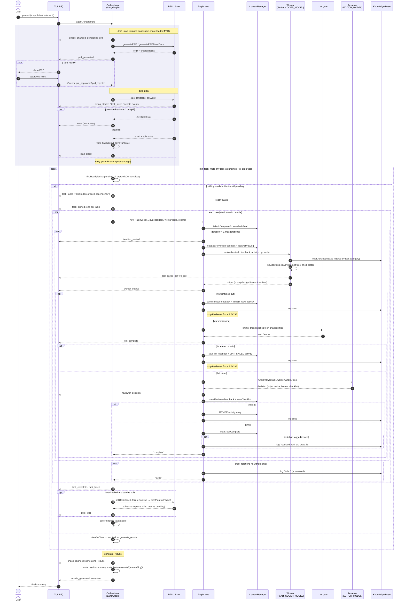

# Agent ↔ Orchestrator Sequence

How the LangGraph orchestrator (`src/agent/graph.mts`) drives the per-task
Ralph loop (`src/ralph/loop.mts`), which in turn runs the Worker (ReAct agent,
`CODER_MODEL`) and the Reviewer (`EDITOR_MODEL`) against Ollama. Every step
reports to the Ink TUI through the `agentEvents` bus (`src/agent/events.mts`).

## Participants

| Participant  | Source                              | Role |
|--------------|-------------------------------------|------|
| TUI          | `src/index.mts`, `src/ui/`          | Starts the run, renders `agentEvents` (feed, progress board) |
| Orchestrator | `src/agent/graph.mts`               | LangGraph: `draft_plan → size_plan → ratify_plan → run_task ⟲ → generate_results` |
| PRD / Sizer  | `src/prd/`                          | PRD generation, task sizing + debate, auto-split on failure |
| RalphLoop    | `src/ralph/loop.mts`                | Worker → lint gate → Reviewer loop, up to `maxIterations` per task |
| Context      | `src/ralph/context-manager.mts`     | On-disk activity log, reviewer feedback, checklists, completion markers |
| Worker       | `src/ralph/worker.mts`              | ReAct agent with file/shell/test/lint tools + knowledge base |
| Lint         | `src/tools/run-linter.mts`          | ESLint fix + check, scoped to files this iteration changed |
| Reviewer     | `src/ralph/reviewer.mts`            | Returns `ship` / `revise` with issues and AC checklist |
| KB           | `src/knowledge-base/`               | Global issue → resolution records read by the Worker |

## Sequence

## Notes

- **Two event buses.** `agentEvents` carries Agent → UI traffic (dashed arrows
  to the TUI above). `uiEvents` carries UI → Agent input, today only PRD
  approval.
- **The Reviewer only sees code that compiled through the lint gate and came
  from a Worker that finished within its step budget.** A timeout or unfixable
  lint error forces another iteration with targeted feedback instead.
- **State lives on disk.** Each iteration re-reads the last reviewer feedback
  and the activity log through `ContextManager`, so a new Worker starts with
  the history of prior attempts. `saveRunState` after sizing and after every
  batch makes the run resumable.
- **Parallelism is per batch.** All ready tasks in a batch run concurrently;
  the next batch starts only after the whole batch settles.
